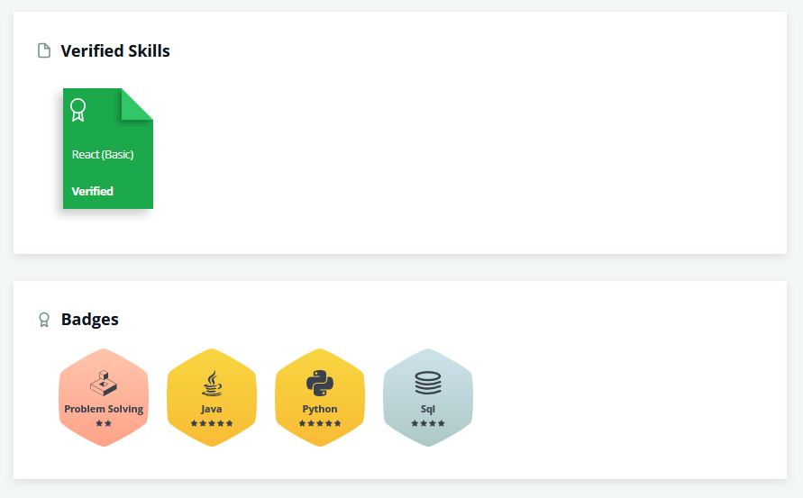

# Algorithms (Deprecated)
A collection of personal solutions to coding challenges from various platforms including LeetCode, HackerRank, and CodeSignal.

Leetcode * https://leetcode.com/theodoremoreland/

Hacker Rank * https://www.hackerrank.com/theodoremoreland?hr_r=1

Code Signal * https://app.codesignal.com/profile/theodore_m1

# Hacker Rank 1 (12/22/2020)

# Folders and files

    | language-agnostic
    |  ┗ easy
    |     +-- Fizz Buzz.md
    |     ...
    |  ┗ medium
    |     +-- Longest Palindromic Substring.md
    |     ...
    |  ┗ hard
    |     +-- Regular Expression Matching.md
    |     ...
    | language-specific
    |  ┗ Java
    |     ┗ easy
    |       +-- Java Method Overriding.md
    |       ...
    |     ┗ medium
    |       +-- Java Generics.md
    |  ┗ Python
    |     ┗ easy
    |           +-- List Comprehensions.md
    |           ...
    |     ┗ medium
    |           +-- Print Function.md
    |           ...
    |     ┗ hard
    |           +-- Minion Game.md
    |           ...
    |  ┗ RegEx
    |    ┗ easy
    |      +-- Detect HTML Tags.md
    |      ...
    |    ┗ medium
    |       +-- Backreferences To Failed Groups.md
    |       ...
    |    ┗ hard
    |       +-- Programming Language Detection.md
    |       ...
    |  ┗ SQL
    |     ┗ easy
    |         +-- Duplicate Emails.md
    |         ...